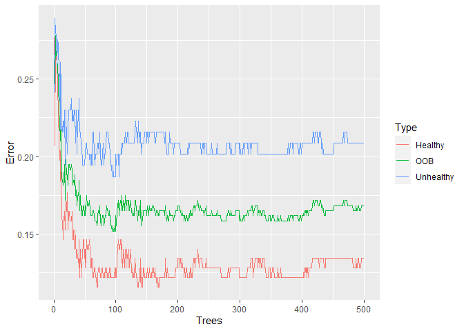
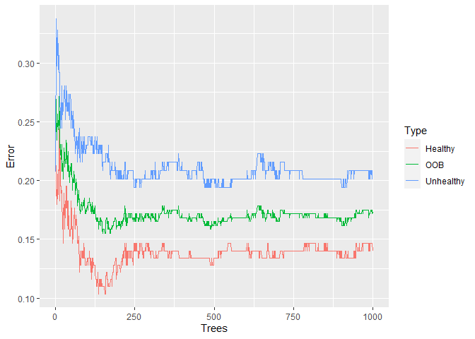
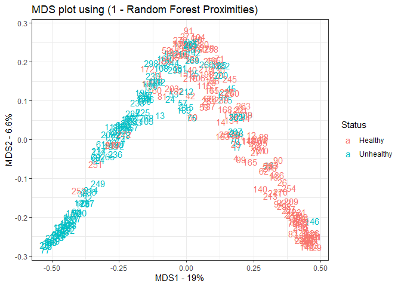

heart disease classification
================
Himanshu Barsinge
10/09/2021

## Importing libraries

We will be working with ggplot(in tidyverse) to make graphs and
randomForest to do the analysis.

``` r
library(tidyverse)
library(cowplot)
library(randomForest)
```

## Importing Data

We will be working on a dataset from UCI machine learning repository.
[Click here](http://archive.ics.uci.edu/ml/datasets/Heart+Disease) to
check out the data. The column names will be explained when we rename
the data frame.

``` r
url <- "http://archive.ics.uci.edu/ml/machine-learning-databases/heart-disease/processed.cleveland.data"

data <- read.csv(url, header = FALSE)
head(data)
```

    ##   V1 V2 V3  V4  V5 V6 V7  V8 V9 V10 V11 V12 V13 V14
    ## 1 63  1  1 145 233  1  2 150  0 2.3   3 0.0 6.0   0
    ## 2 67  1  4 160 286  0  2 108  1 1.5   2 3.0 3.0   2
    ## 3 67  1  4 120 229  0  2 129  1 2.6   2 2.0 7.0   1
    ## 4 37  1  3 130 250  0  0 187  0 3.5   3 0.0 3.0   0
    ## 5 41  0  2 130 204  0  2 172  0 1.4   1 0.0 3.0   0
    ## 6 56  1  2 120 236  0  0 178  0 0.8   1 0.0 3.0   0

As we can see none of the columns are labeled. So we name the columns
after the names that were listed on the UCI website. We use 14 columns  
1. (age) - age in years  
2. (sex) - sex (1 = male, 0 = female)  
3. (cp) - chest pain type (1 = typical angina, 2 = atypical angina 3 =
non-anginal pain 4 = asymptomatic)  
4. (trestbps) - resting blood pressure (in mm of Hg)  
5. (chol) - Cholesterol in mg/dl  
6. (fbs) - fasting blood sugar &gt; 120 mg/dll (1=True, 0= False)  
7. (restecg) - resting ECG results  
8. (thalach) - maximum heart rate achieved  
9. (exang) - exercise induced angina(1=yes, 0=no)  
10. (oldpeak) - ST depression induced by exercise ST segment  
11. (slope) - slope of peak exercise segment (1=upsloling, 2=flat,
3=downsloping)  
12. (ca) - number of major vessels (0-3) colored by flouroscopy  
13. (thal) - 3=normal, 6=fixed defect, 7=reversible defect  
14. (num) (the predicted attribute) - Diagnosis of heart disease (0 =
&lt;50% diameter narrowing, 1 = ?50% diameter narrowing)

``` r
colnames(data) <- c(
  "age",
  "sex",# 0 = female, 1 = male
  "cp", # chest pain 
          # 1 = typical angina, 
          # 2 = atypical angina, 
          # 3 = non-anginal pain, 
          # 4 = asymptomatic
  "trestbps", # resting blood pressure (in mm Hg)
  "chol", # serum cholestoral in mg/dl
  "fbs",  # fasting blood sugar if less than 120 mg/dl, 1 = TRUE, 0 = FALSE
  "restecg", # resting electrocardiographic results
          # 1 = normal
          # 2 = having ST-T wave abnormality
          # 3 = showing probable or definite left ventricular hypertrophy
  "thalach", # maximum heart rate achieved
  "exang",   # exercise induced angina, 1 = yes, 0 = no
  "oldpeak", # ST depression induced by exercise relative to rest
  "slope", # the slope of the peak exercise ST segment 
          # 1 = upsloping 
          # 2 = flat 
          # 3 = downsloping 
  "ca", # number of major vessels (0-3) colored by fluoroscopy
  "thal", # this is short of thalium heart scan
          # 3 = normal (no cold spots)
          # 6 = fixed defect (cold spots during rest and exercise)
          # 7 = reversible defect (when cold spots only appear during exercise)
  "hd" # (the predicted attribute) - diagnosis of heart disease 
          # 0 if less than or equal to 50% diameter narrowing
          # 1 if greater than 50% diameter narrowing
)
```

## Reformating and cleaning the data

When we look at the structure of our data, it tells us that a lot of
columns that were supposed to be factors are not factors.

``` r
str(data)
```

    ## 'data.frame':    303 obs. of  14 variables:
    ##  $ age     : num  63 67 67 37 41 56 62 57 63 53 ...
    ##  $ sex     : num  1 1 1 1 0 1 0 0 1 1 ...
    ##  $ cp      : num  1 4 4 3 2 2 4 4 4 4 ...
    ##  $ trestbps: num  145 160 120 130 130 120 140 120 130 140 ...
    ##  $ chol    : num  233 286 229 250 204 236 268 354 254 203 ...
    ##  $ fbs     : num  1 0 0 0 0 0 0 0 0 1 ...
    ##  $ restecg : num  2 2 2 0 2 0 2 0 2 2 ...
    ##  $ thalach : num  150 108 129 187 172 178 160 163 147 155 ...
    ##  $ exang   : num  0 1 1 0 0 0 0 1 0 1 ...
    ##  $ oldpeak : num  2.3 1.5 2.6 3.5 1.4 0.8 3.6 0.6 1.4 3.1 ...
    ##  $ slope   : num  3 2 2 3 1 1 3 1 2 3 ...
    ##  $ ca      : chr  "0.0" "3.0" "2.0" "0.0" ...
    ##  $ thal    : chr  "6.0" "3.0" "7.0" "3.0" ...
    ##  $ hd      : int  0 2 1 0 0 0 3 0 2 1 ...

First thing we do is change the “?” to NA.

``` r
data[data == "?"] <- NA
```

Then we convert the 0s in sex to F and 1s to M

``` r
data[data$sex == 0,]$sex <- "F"
data[data$sex == 1,]$sex <- "M"
data$sex <- as.factor(data$sex)
```

We do something similar for all the other columns that are supposed to
be factors.

``` r
data$cp <- as.factor(data$cp)
data$fbs <- as.factor(data$fbs)
data$restecg <- as.factor(data$restecg)
data$exang <- as.factor(data$exang)
data$slope <- as.factor(data$slope)
```

Since the “ca” and “thal” columns had ? in it, R thinks its a string so
we convert it to integer and then to factor.

``` r
data$ca <- as.integer(data$ca)
data$ca <- as.factor(data$ca)

data$thal <- as.integer(data$thal)
data$thal <- as.factor(data$thal)
```

The last coulmn “hd” aka heart disease a factor and also change it to
“healthy” and “unhealthy” instead of 0 and 1.

``` r
data$hd <- ifelse(test=data$hd == 0, yes="Healthy", no="Unhealthy")
data$hd <- as.factor(data$hd)

str(data)
```

    ## 'data.frame':    303 obs. of  14 variables:
    ##  $ age     : num  63 67 67 37 41 56 62 57 63 53 ...
    ##  $ sex     : Factor w/ 2 levels "F","M": 2 2 2 2 1 2 1 1 2 2 ...
    ##  $ cp      : Factor w/ 4 levels "1","2","3","4": 1 4 4 3 2 2 4 4 4 4 ...
    ##  $ trestbps: num  145 160 120 130 130 120 140 120 130 140 ...
    ##  $ chol    : num  233 286 229 250 204 236 268 354 254 203 ...
    ##  $ fbs     : Factor w/ 2 levels "0","1": 2 1 1 1 1 1 1 1 1 2 ...
    ##  $ restecg : Factor w/ 3 levels "0","1","2": 3 3 3 1 3 1 3 1 3 3 ...
    ##  $ thalach : num  150 108 129 187 172 178 160 163 147 155 ...
    ##  $ exang   : Factor w/ 2 levels "0","1": 1 2 2 1 1 1 1 2 1 2 ...
    ##  $ oldpeak : num  2.3 1.5 2.6 3.5 1.4 0.8 3.6 0.6 1.4 3.1 ...
    ##  $ slope   : Factor w/ 3 levels "1","2","3": 3 2 2 3 1 1 3 1 2 3 ...
    ##  $ ca      : Factor w/ 4 levels "0","1","2","3": 1 4 3 1 1 1 3 1 2 1 ...
    ##  $ thal    : Factor w/ 3 levels "3","6","7": 2 1 3 1 1 1 1 1 3 3 ...
    ##  $ hd      : Factor w/ 2 levels "Healthy","Unhealthy": 1 2 2 1 1 1 2 1 2 2 ...

Now we impute values in the data set

``` r
set.seed(42)
data.imputed <- rfImpute(hd ~ ., # we want hd to be predicted by every other column 
                         data = data, 
                         iter=6) # how man random forests should rfimpute sould build?
```

    ## ntree      OOB      1      2
    ##   300:  17.49% 12.80% 23.02%
    ## ntree      OOB      1      2
    ##   300:  16.83% 14.02% 20.14%
    ## ntree      OOB      1      2
    ##   300:  17.82% 13.41% 23.02%
    ## ntree      OOB      1      2
    ##   300:  17.49% 14.02% 21.58%
    ## ntree      OOB      1      2
    ##   300:  17.16% 12.80% 22.30%
    ## ntree      OOB      1      2
    ##   300:  18.15% 14.63% 22.30%

iter = the number of iterations to run. Breiman says 4 to 6 iterations
is usually good enough. With this dataset, when we set iter=6, OOB-error
bounces around between 17% and 18%. When we set iter=20, we get values a
little better and a little worse, so doing more iterations doesn’t
improve the situation.

NOTE: If you really want to micromanage how rfImpute(), you can change
the number of trees it makes (the default is 300) and the number of
variables that it will consider at each step.

For most machine learning methods, you need to divide the data manually
into a “training” set and a “test” set. This allows you to train the
method using the training data, and then test it on data it was not
originally trained on. In contrast, Random Forests split the data into
“training” and “test” sets for you. This is because Random Forests use
bootstrapped data, and thus, not every sample is used to build every
tree. The “training” dataset is the bootstrapped data and the “test”
dataset is the remaining samples. The remaining samples are called the
“Out-Of-Bag” (OOB) data.

## Building the Random Forest

We build the model using the randomForest function.

``` r
model <- randomForest(hd ~.,
                      data = data.imputed,
                      proximity = TRUE) # Return the proximity matrix
```

NOTE: If the thing we’re trying to predict (in this case it is whether
or not someone has heart disease) is a continuous number (i.e. “weight”
or “height”), then by default, randomForest() will set “mtry”, the
number of variables to consider at each step, to the total number of
variables divided by 3 (rounded down), or to 1 (if the division results
in a value less than 1). If the thing we’re trying to predict is a
“factor” (i.e. either “yes/no” or “ranked”), then randomForest() will
set mtry to the square root of the number of variables (rounded down to
the next integer value).

In this example, “hd”, the thing we are trying to predict, is a factor
and there are 13 variables. So by default, randomForest() will set mtry
= sqrt(13) = 3.6 rounded down = 3 Also, by default random forest
generates 500 trees (NOTE: rfImpute() only generates 300 tress by
default)

``` r
model
```

    ## 
    ## Call:
    ##  randomForest(formula = hd ~ ., data = data.imputed, proximity = TRUE) 
    ##                Type of random forest: classification
    ##                      Number of trees: 500
    ## No. of variables tried at each split: 3
    ## 
    ##         OOB estimate of  error rate: 16.83%
    ## Confusion matrix:
    ##           Healthy Unhealthy class.error
    ## Healthy       142        22   0.1341463
    ## Unhealthy      29       110   0.2086331

RandomForest returns all kinds of things like :-  
1) The out-of-bag error rate for the forest with ntrees. In this case
ntrees = 500 by default.  
2)The confusion matrix for the forest with ntree trees.

## Checking if more trees = more accuracy

To see if 500 trees is enough to classify correctly we make a plot of
OOB vs. ntrees

``` r
oob.error.data <- data.frame(
  Trees=rep(1:nrow(model$err.rate), times=3),
  Type=rep(c("OOB", "Healthy", "Unhealthy"), each=nrow(model$err.rate)),
  Error=c(model$err.rate[,"OOB"], 
    model$err.rate[,"Healthy"], 
    model$err.rate[,"Unhealthy"]))

ggplot(data=oob.error.data, aes(x=Trees, y=Error)) +
  geom_line(aes(color=Type))
```

<!-- -->
Blue line = The error rate specifically for calling “Unheathly” patients
that are OOB.  
Green line = The overall OOB error rate.  
Red line = The error rate specifically for calling “Healthy” patients
that are OOB.

After building a random forest with 500 tress, the graph does not make
it clear that the OOB-error has settled on a value or, if we added more
trees, it would continue to decrease. So we do the whole thing again,
but this time add more trees.

``` r
model <- randomForest(hd ~ ., data=data.imputed, ntree=1000, proximity=TRUE)
model
```

    ## 
    ## Call:
    ##  randomForest(formula = hd ~ ., data = data.imputed, ntree = 1000,      proximity = TRUE) 
    ##                Type of random forest: classification
    ##                      Number of trees: 1000
    ## No. of variables tried at each split: 3
    ## 
    ##         OOB estimate of  error rate: 17.16%
    ## Confusion matrix:
    ##           Healthy Unhealthy class.error
    ## Healthy       141        23   0.1402439
    ## Unhealthy      29       110   0.2086331

``` r
oob.error.data <- data.frame(
  Trees=rep(1:nrow(model$err.rate), times=3),
  Type=rep(c("OOB", "Healthy", "Unhealthy"), each=nrow(model$err.rate)),
  Error=c(model$err.rate[,"OOB"], 
    model$err.rate[,"Healthy"], 
    model$err.rate[,"Unhealthy"]))

ggplot(data=oob.error.data, aes(x=Trees, y=Error)) +
  geom_line(aes(color=Type))
```

<!-- -->
After building a random forest with 1,000 trees, we get the same
OOB-error 16.5% and we can see convergence in the graph. So we could
have gotten away with only 500 trees, but we wouldn’t have been sure
that number was enough.

## To see if we are considering the optimal number of columns at each internal node of a tree

``` r
#We start by making an empty vector that can hold 10 values
oob.values <- vector(length=10)

#Then we create a loop that tests different number of variables at each step.
for(i in 1:10) {
  temp.model <- randomForest(hd ~ ., data=data.imputed, mtry=i, ntree=1000)
  oob.values[i] <- temp.model$err.rate[nrow(temp.model$err.rate),1]
}
oob.values
```

    ##  [1] 0.1749175 0.1782178 0.1716172 0.1782178 0.1683168 0.1881188 0.1815182
    ##  [8] 0.1980198 0.1782178 0.1848185

The third value has lowest OOB error rate, so the defalut value was
optimal.

## Drawing an MDS plot with samples

We will try to see how the samples are related to each other using multi
dimensional scaling.  
Multi-Dimensional Scaling is the same as Principal component analysis
but we use different types of distance between the sample instead of
euclidean distance.

``` r
model <- randomForest(hd ~ ., 
                      data=data.imputed,
                      ntree=1000, 
                      proximity=TRUE, 
                      mtry=which(oob.values == min(oob.values)))

# Start by coverting the proximity matrix to a distance matrix
distance.matrix <- as.dist(1-model$proximity)
mds.stuff <- cmdscale(distance.matrix, eig=TRUE, x.ret=TRUE) #cmdscale stands for classical Multi-dimensional scaling

## calculate the percentage of variation that each MDS axis accounts for...
mds.var.per <- round(mds.stuff$eig/sum(mds.stuff$eig)*100, 1)
```

Now lets plot the MDS components using ggplot.

``` r
mds.values <- mds.stuff$points
mds.data <- data.frame(Sample=rownames(mds.values),
  X=mds.values[,1],
  Y=mds.values[,2],
  Status=data.imputed$hd)

ggplot(data=mds.data, aes(x=X, y=Y, label=Sample)) + 
  geom_text(aes(color=Status)) +
  theme_bw() +
  xlab(paste("MDS1 - ", mds.var.per[1], "%", sep="")) +
  ylab(paste("MDS2 - ", mds.var.per[2], "%", sep="")) +
  ggtitle("MDS plot using (1 - Random Forest Proximities)")
```

<!-- -->
